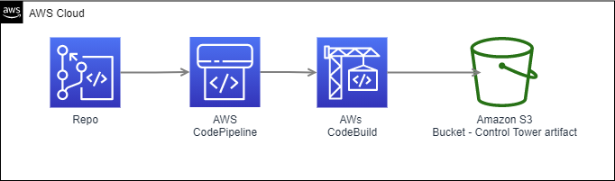

==================================
AWS Control Tower Manifest Builder
==================================

.. image:: https://img.shields.io/pypi/v/aws_control_tower_manifest_builder.svg
        :target: https://pypi.python.org/pypi/aws_control_tower_manifest_builder

.. image:: https://github.com/gabrielbac/aws_control_tower_manifest_builder/actions/workflows/test.yaml/badge.svg
        :target: https://github.com/gabrielbac/aws_control_tower_manifest_builder/actions/workflows/test.yaml/

.. image:: https://github.com/gabrielbac/aws_control_tower_manifest_builder/actions/workflows/release.yaml/badge.svg
        :target: https://github.com/gabrielbac/aws_control_tower_manifest_builder/actions/workflows/release.yaml/

.. image:: https://readthedocs.org/projects/aws-control-tower-manifest-builder/badge/?version=latest
        :target: https://aws-control-tower-manifest-builder.readthedocs.io/en/latest/?version=latest
        :alt: Documentation Status

Python package to automatically build the AWS Control Tower Manifest given Cloud Formation templates and SCPs as input.

* Free software: MIT license
* Documentation: https://aws-control-tower-manifest-builder.readthedocs.io.

Features
--------

* Reads Cloud Formation templates and Service Control Policies from specified directories and produces the AWS Control Tower manifest.yaml file.
* See https://s3.amazonaws.com/solutions-reference/customizations-for-aws-control-tower/latest/customizations-for-aws-control-tower-developer-guide.pdf

Quick start
-----------

1. Run ``pip install aws-control-tower-manifest-builder``
2. Download sample template and SCPs from S3 "Add link". Extract to directory
3. Run ``aws_control_tower_manifest_builder --input-cf sample_templates --input-scp sample_scp --output output_manifest``
    Note: the sample template includes incorrecly formatted templates.

For Developers - before pushing a branch (to be replace by tox)
---------------------------------------------------------------

1. Clone the repo
2. ``make venv``
3. ``make black``
4. ``make lint``
5. ``make test``
6. ``make local-test``

* Cloud Formation templates require a metadata section with the following info:

.. code-block:: yaml
  
   Metadata:
     manifest_parameters:
     name: detailed_template # Optional. Defaults to the file name. a-z, A-Z, 0-9, and an underscore (_).
     deploy_method: stackset # Optional. All file in the template directory use "stackset" and in policy directory use "scp".
     accounts: ["123456789012", "987456123989"] # Requires "accounts" and/or "organizational_unit". [0-9]{12}
     organizational_units: ["dev", "prod"] # Requires "accounts" and/or "organizational_unit".
     regions: ["us-east-1" , "us-east-2"] # Optional. Defaults to us-east-1.
     parameters: # Optional. List of parameters [SSM, Alfred, Values]
     - parameter_key: parameter1
       parameter_value: value1
     - parameter_key: parameter2
       parameter_value: value2
     export_outputs: # Optional. list of ssm parameters to store output values
     - name: /org/member/test-ssm/app-id
       value: $[output_ApplicationId]

